# ER Diagram - AI Career Development Platform

## Database Relationships Overview

```mermaid
erDiagram
    USERS ||--o{ OTP_VERIFICATIONS : has
    USERS ||--o{ RESUMES : uploads
    USERS ||--o{ SKILLS : possesses
    USERS ||--o{ CAREER_RECOMMENDATIONS : receives
    USERS ||--o{ JOB_APPLICATIONS : submits
    USERS ||--o{ SAVED_JOBS : saves
    USERS ||--o{ ENROLLMENTS : enrolls
    USERS ||--o{ NOTIFICATIONS : receives
    USERS ||--o{ ADMIN_LOGS : performs

    JOBS ||--o{ JOB_APPLICATIONS : has
    JOBS ||--o{ SAVED_JOBS : saved_by
    
    COURSES ||--o{ ENROLLMENTS : has
    
    USERS {
        int id PK
        string username UK
        string email UK
        string password_hash
        string first_name
        string last_name
        string phone
        string location
        string headline
        text bio
        string profile_image
        enum role "user, admin"
        boolean is_verified
        boolean is_active
        timestamp created_at
        timestamp updated_at
    }

    OTP_VERIFICATIONS {
        int id PK
        int user_id FK
        string otp
        string email
        enum purpose "registration, password_reset"
        boolean is_used
        timestamp created_at
        timestamp expires_at
    }

    RESUMES {
        int id PK
        int user_id FK "UNIQUE"
        string file_path
        string file_name
        int file_size
        text original_text
        json parsed_data
        decimal resume_score
        json extracted_skills
        json extracted_education
        json extracted_experience
        boolean is_analyzed
        timestamp analyzed_at
        timestamp uploaded_at
        timestamp updated_at
    }

    SKILLS {
        int id PK
        int user_id FK
        string skill_name
        enum proficiency_level "beginner, intermediate, advanced, expert"
        decimal years_of_experience
        int endorsements
        boolean is_verified
        timestamp created_at
        timestamp updated_at
    }

    CAREER_RECOMMENDATIONS {
        int id PK
        int user_id FK
        string recommended_job_title
        decimal match_percentage
        json skill_gap_analysis
        json learning_roadmap
        string estimated_timeline
        json salary_range
        string market_demand
        json interview_questions
        text recommendation_reason
        timestamp created_at
        timestamp updated_at
    }

    JOBS {
        int id PK
        string job_title
        string company_name
        text description
        text requirements
        decimal salary_min
        decimal salary_max
        string currency
        string location
        enum job_type "full-time, part-time, contract, internship, freelance"
        enum experience_level "entry, mid, senior, lead"
        json skills_required
        string company_logo
        string apply_link
        int posted_by_admin FK
        boolean is_active
        timestamp posted_at
        timestamp expires_at
        timestamp updated_at
    }

    JOB_APPLICATIONS {
        int id PK
        int user_id FK
        int job_id FK
        enum application_status "applied, reviewed, shortlisted, rejected, accepted"
        text cover_letter
        timestamp applied_at
        timestamp reviewed_at
        timestamp status_updated_at
    }

    SAVED_JOBS {
        int id PK
        int user_id FK
        int job_id FK
        timestamp saved_at
    }

    COURSES {
        int id PK
        string course_name
        text description
        enum course_level "beginner, intermediate, advanced"
        string instructor_name
        int duration_hours
        string course_image
        string course_link
        string category
        json skills_taught
        boolean certification_available
        int created_by_admin FK
        boolean is_active
        timestamp created_at
        timestamp updated_at
    }

    ENROLLMENTS {
        int id PK
        int user_id FK
        int course_id FK
        enum enrollment_status "enrolled, in_progress, completed, dropped"
        decimal progress_percentage
        timestamp completion_date
        boolean certificate_issued
        string certificate_number
        timestamp enrolled_at
        timestamp updated_at
    }

    NOTIFICATIONS {
        int id PK
        int user_id FK
        enum notification_type "job_match, course_recommendation, application_update, alert, system"
        string title
        text message
        int related_id
        boolean is_read
        boolean is_sent_email
        timestamp created_at
    }

    ADMIN_LOGS {
        int id PK
        int admin_id FK
        string action
        string entity_type
        int entity_id
        json details
        string ip_address
        string user_agent
        timestamp created_at
    }
```

## Key Relationships Explained

### One-to-One Relationships
1. **USERS ↔ RESUMES**: Each user has at most one resume (UNIQUE constraint on user_id)
   - When a user uploads a resume, previous one is replaced
   - Contains extracted data for AI analysis

### One-to-Many Relationships
1. **USERS → OTP_VERIFICATIONS**: One user can have multiple OTP records (for registration, password reset, etc.)
2. **USERS → SKILLS**: One user can have multiple skills
3. **USERS → CAREER_RECOMMENDATIONS**: One user receives multiple career recommendations over time
4. **USERS → JOB_APPLICATIONS**: One user applies to multiple jobs
5. **USERS → SAVED_JOBS**: One user saves multiple jobs
6. **USERS → ENROLLMENTS**: One user enrolls in multiple courses
7. **USERS → NOTIFICATIONS**: One user receives multiple notifications
8. **JOBS → JOB_APPLICATIONS**: One job receives multiple applications
9. **JOBS → SAVED_JOBS**: One job is saved by multiple users
10. **COURSES → ENROLLMENTS**: One course has multiple student enrollments
11. **USERS → ADMIN_LOGS**: Admin user performs multiple actions (logged)

### Many-to-Many Relationships
- Implemented through junction/bridge tables:
  - **JOB_APPLICATIONS**: Links USERS to JOBS (multiple users can apply to multiple jobs)
  - **SAVED_JOBS**: Links USERS to JOBS (multiple users can save multiple jobs)
  - **ENROLLMENTS**: Links USERS to COURSES (multiple users can enroll in multiple courses)

## Key Features of the Schema

### Security Features
- Password hashing (not plaintext)
- Timestamps for audit trails
- Admin logs for tracking administrative actions
- IP address and user agent tracking

### Data Integrity
- Foreign key constraints ensure referential integrity
- UNIQUE constraints prevent duplicates (e.g., one resume per user)
- Proper indexing for query performance

### Normalization
- Third Normal Form (3NF) compliance
- Separate tables for different entities
- No data redundancy
- Efficient relationships using foreign keys

### JSON Columns for Flexibility
- `parsed_data`: Resume parsing results
- `extracted_skills`: Skills extracted from resume
- `skill_gap_analysis`: AI-generated skill gaps
- `learning_roadmap`: Personalized learning path
- `interview_questions`: Generated interview questions
- `skills_taught`: Skills in each course
- `skills_required`: Skills needed for a job

### Timestamps for Tracking
- `created_at`: When record was created
- `updated_at`: Last modification time
- Other specific timestamps for tracking states (e.g., `expires_at`, `completion_date`)
